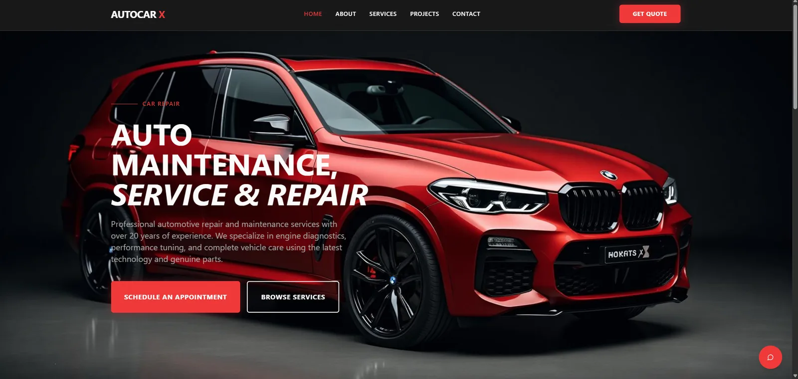

# AutoCar X

Marketing and lead-generation platform for a premium automotive workshop — it turns visitors researching diagnostics, restoration or performance work into qualified enquiries the workshop can track from first contact to booking.



## Live demo

- Live demo (front end): [autocarx.netlify.app](https://autocarx.netlify.app/)
- Case study: [lumax.agency/work/autocarx](https://www.lumax.agency/work/autocarx)

The lead API and the lead-management dashboard run on the Node server (see [Running locally](#running-locally)); the hosted demo serves the front end.

## Status

Independent portfolio project. The workshop, vehicle projects, pricing and service data are demonstration content, not a real business.

## Overview

Independent workshops lose work in the gap between "how much would this roughly cost?" and an actual enquiry. Static brochure sites answer neither question, and enquiries that do arrive land in an inbox with no follow-up state.

AutoCar X closes that gap: a service estimator gives visitors an indicative price range up front and hands the selection straight into the contact form, every enquiry is validated and stored as a lead with its source attached, and a private "Lead desk" dashboard lets the workshop move each lead through a simple pipeline (new → contacted → quoted → booked → closed).

## Features

- Interactive service estimator — pick from eight service categories, get an indicative ±10% price range, and jump to the contact form with the selection and estimate pre-filled
- Lead capture with server-side validation, a honeypot field against bots, per-IP rate limiting and source attribution (estimator vs. plain contact)
- Workshop lead management at `/workshop/leads` — rate-limited login, expiring HttpOnly cookie sessions, lead list, and one-click status pipeline updates; production fails closed when admin credentials are absent
- Optional AI service assistant — a chat widget backed by a locked-down Supabase Edge Function; disabled by default and rendered only when its public Supabase configuration is present
- Marketing site: home, services, process, project gallery (8 featured builds), about and contact pages, with OG tags, JSON-LD (`AutoRepair` schema), sitemap and robots.txt

## Tech stack

- React 18 + TypeScript + Vite
- Tailwind CSS + shadcn/ui (Radix primitives)
- React Router, TanStack Query, React Hook Form + Zod
- Node.js (zero-dependency `node:http` server) + SQLite via the built-in `node:sqlite` module
- Supabase Edge Function (Deno) for the AI assistant

## Technical decisions

- **Zero-dependency backend.** The lead API is a single `node:http` server with the built-in `node:sqlite` driver (WAL mode) — no Express, no ORM. For a service this size that removes the entire backend supply chain while keeping the essentials: timing-safe credential comparison, separate login and lead rate limits, expiring `HttpOnly`/`SameSite=Strict` sessions and server-side input validation. Production refuses admin login unless credentials are explicitly configured. The same process can serve the built SPA, so deployment is one Node process.
- **Estimator as a lead qualifier, not a quote engine.** Pricing is a deterministic client-side config with a ±10% band, explicitly labelled indicative. Its real job is hand-off: the selection and range travel to the contact form via URL params, so the lead arrives with `source: "estimator"` and full context — the workshop knows what the visitor priced before the first call.
- **Optional AI, isolated and fail-closed at the edge.** The chatbot's LLM key never reaches the client. The Edge Function requires Supabase JWT verification, an explicit server-side enable flag, an origin allowlist, bounded messages and a best-effort per-IP rate limit. With no public Supabase env vars, the widget is omitted from the app entirely, so the core product has no AI dependency.

## Running locally

Requires Node.js 20.19+ or 22.12+ (Node 24 recommended; the API server uses the built-in `node:sqlite` module).

```sh
npm install
cp .env.example .env

# Terminal 1 — lead API (SQLite, port 3002)
npm run dev:api

# Terminal 2 — Vite dev server (port 8080, proxies /api to 3002)
npm run dev
```

Production build and single-process serve:

```sh
npm run build
npm start
```

Configuration is via environment variables — see [.env.example](./.env.example). `.env` is intentionally ignored. In production, `ADMIN_EMAIL` and `ADMIN_PASSWORD` are required for admin access; the code-level development fallback is never accepted in production.

### Optional AI assistant

The hosted front end works without AI. To enable the assistant deliberately:

1. Configure `VITE_SUPABASE_URL` and `VITE_SUPABASE_PUBLISHABLE_KEY` in the front-end build environment.
2. Deploy `supabase/functions/chat` with JWT verification enabled.
3. Store `LOVABLE_API_KEY`, `AI_CHAT_ENABLED=true` and a comma-separated `ALLOWED_ORIGINS` value as Supabase server-side secrets.

Do not put `LOVABLE_API_KEY` in `.env` or any `VITE_*` variable. The in-memory edge rate limit is only an additional guard; a production deployment should also use provider-level quotas or authentication for durable abuse protection.

### Verification

```sh
npm run lint
npm test
npm run build
npm audit --audit-level=high
```

The repository includes a GitHub Actions workflow for the same checks and a Netlify SPA fallback so direct links and page refreshes resolve to the React router.

## License

[MIT](LICENSE). Product names, logos, vehicle imagery and demonstration content remain the property of their respective owners and are not covered by the code license.
